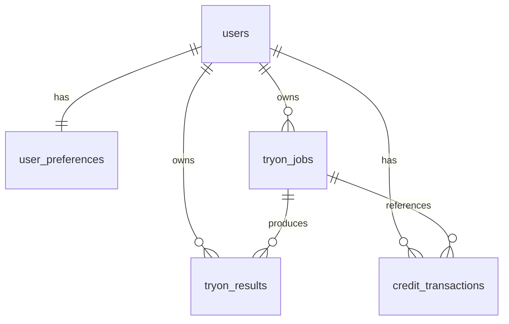

# 数据库接口设计

更新时间：2026-06-13

本文档描述 OPC 智能试衣平台当前数据库接口设计。这里的“数据库接口”指平台后端 `app.py` 对 PostgreSQL 的表结构、读写边界、业务状态流转和对外 HTTP API 与数据表之间的映射。

## 1. 数据库连接

平台后端通过 `psycopg` 直连 PostgreSQL，不使用 ORM。

- 连接入口：`app.py` 中的 `db()`
- 连接配置优先级：优先读取 `DATABASE_URL`；未设置时由 `POSTGRES_HOST`、`POSTGRES_PORT`、`POSTGRES_DB`、`POSTGRES_USER`、`POSTGRES_PASSWORD` 拼接。
- 行格式：`psycopg.rows.dict_row`，接口返回时直接使用字段名访问。
- 初始化：应用启动时执行 `init_db()`，使用 `CREATE TABLE IF NOT EXISTS` 自动创建业务表，并调用 `seed_demo_data()` 写入演示账号和示例作品。

当前远程库探索结果：

| 表 | 当前行数 | 用途 |
| --- | ---: | --- |
| `users` | 1 | 用户账号、密码哈希、头像、会员计划、积分余额 |
| `user_preferences` | 1 | 用户偏好设置 |
| `tryon_jobs` | 22 | 生成任务主表 |
| `tryon_results` | 4 | 生成结果/作品表 |
| `credit_transactions` | 34 | 积分流水 |

## 2. 数据模型关系



删除策略：

- 删除 `users` 会级联删除其 `user_preferences`、`tryon_jobs`、`tryon_results`、`credit_transactions`。
- 删除 `tryon_jobs` 会级联删除其 `tryon_results`。
- `credit_transactions.job_id` 引用任务；任务删除时该字段置空。

## 3. 表结构

### 3.1 `users`

用户账号和积分余额表。

| 字段 | 类型 | 约束/默认值 | 说明 |
| --- | --- | --- | --- |
| `id` | `BIGSERIAL` | PK | 用户 ID |
| `email` | `TEXT` | NOT NULL, UNIQUE | 登录邮箱，后端统一小写保存 |
| `name` | `TEXT` | NOT NULL | 用户昵称 |
| `password_hash` | `TEXT` | NOT NULL | `pbkdf2_sha256` 哈希串 |
| `avatar_url` | `TEXT` | NOT NULL | 头像 URL |
| `plan` | `TEXT` | NOT NULL, default `VIP 3级会员` | 会员计划展示字段 |
| `credits` | `INTEGER` | NOT NULL, default `250`, CHECK `credits >= 0` | 当前积分余额 |
| `created_at` | `TIMESTAMPTZ` | NOT NULL, default `now()` | 创建时间 |

索引：

- `users_pkey`：`id`
- `users_email_key`：`email`

### 3.2 `user_preferences`

用户偏好表，与 `users` 一对一。

| 字段 | 类型 | 约束/默认值 | 说明 |
| --- | --- | --- | --- |
| `user_id` | `BIGINT` | PK, FK `users(id)` ON DELETE CASCADE | 用户 ID |
| `push_notifications` | `BOOLEAN` | NOT NULL, default `TRUE` | 推送通知开关 |
| `hd_generation` | `BOOLEAN` | NOT NULL, default `TRUE` | 高清生成偏好 |

### 3.3 `tryon_jobs`

生成任务主表。`model` 和 `real` 模式走双图试穿；`free` 模式走单图编辑。

| 字段 | 类型 | 约束/默认值 | 说明 |
| --- | --- | --- | --- |
| `id` | `BIGSERIAL` | PK | 任务 ID |
| `user_id` | `BIGINT` | NOT NULL, FK `users(id)` ON DELETE CASCADE | 所属用户 |
| `mode` | `TEXT` | NOT NULL, CHECK in `model`,`real`,`free` | 生成模式 |
| `title` | `TEXT` | NOT NULL | 任务标题 |
| `status` | `TEXT` | NOT NULL, CHECK in `submitting`,`processing`,`completed`,`failed` | 任务状态 |
| `prompt_id` | `TEXT` | nullable | 远程生成服务任务 ID；多图生成时保存 JSON 字符串数组 |
| `person_image` | `TEXT` | NOT NULL | 人物图/参考图。`free` 模式下等于单图参考图 |
| `clothing_image` | `TEXT` | NOT NULL | 服装图。`free` 模式下等于单图参考图 |
| `prompt` | `TEXT` | NOT NULL | 生成提示词 |
| `garment_type` | `TEXT` | NOT NULL | 服装类型展示字段 |
| `quantity` | `INTEGER` | NOT NULL, default `1` | 生成数量，接口层限制为 1 到 8 |
| `cost` | `INTEGER` | NOT NULL, default `0` | 本任务消耗积分 |
| `seed` | `BIGINT` | nullable | 远程服务返回的种子；多任务时保存第一张的 seed |
| `error` | `TEXT` | nullable | 失败或轮询异常信息 |
| `created_at` | `TIMESTAMPTZ` | NOT NULL, default `now()` | 创建时间 |
| `updated_at` | `TIMESTAMPTZ` | NOT NULL, default `now()` | 更新时间 |
| `completed_at` | `TIMESTAMPTZ` | nullable | 完成时间 |

状态流转：

```text
submitting -> processing -> completed
                       \-> failed
```

关键规则：

- 创建任务前先扣积分并写入 `credit_transactions`。
- 远程提交失败时，任务置为 `failed` 并退回积分。
- 查询任务时，如果状态为 `processing` 且有 `prompt_id`，后端会轮询远程结果；全部完成且有有效输出图时写入 `tryon_results`，并将任务置为 `completed`。
- 远程结果会过滤 `type=temp` 或 URL 包含 `type=temp` 的临时图。

### 3.4 `tryon_results`

生成结果/作品表。

| 字段 | 类型 | 约束/默认值 | 说明 |
| --- | --- | --- | --- |
| `id` | `BIGSERIAL` | PK | 结果 ID |
| `job_id` | `BIGINT` | NOT NULL, FK `tryon_jobs(id)` ON DELETE CASCADE | 来源任务 |
| `user_id` | `BIGINT` | NOT NULL, FK `users(id)` ON DELETE CASCADE | 所属用户 |
| `image_url` | `TEXT` | NOT NULL | 生成图 URL |
| `thumbnail_url` | `TEXT` | nullable | 缩略图 URL；当前默认与 `image_url` 相同 |
| `source` | `TEXT` | NOT NULL, default `tryon` | 结果来源：双图为 `tryon`，自由风格为 `image-edit` |
| `favorite` | `BOOLEAN` | NOT NULL, default `FALSE` | 是否收藏 |
| `created_at` | `TIMESTAMPTZ` | NOT NULL, default `now()` | 入库时间 |

写入规则：

- 同一个 `job_id` 已有结果时，`persist_results()` 不再重复写入。
- 结果列表按 `id ASC` 返回给任务详情接口。

### 3.5 `credit_transactions`

积分流水表，用于记录扣费、退款、充值。

| 字段 | 类型 | 约束/默认值 | 说明 |
| --- | --- | --- | --- |
| `id` | `BIGSERIAL` | PK | 流水 ID |
| `user_id` | `BIGINT` | NOT NULL, FK `users(id)` ON DELETE CASCADE | 所属用户 |
| `amount` | `INTEGER` | NOT NULL | 积分变动量；扣费为负，充值/退款为正 |
| `balance_after` | `INTEGER` | NOT NULL | 变动后的余额 |
| `reason` | `TEXT` | NOT NULL | 流水原因 |
| `job_id` | `BIGINT` | nullable, FK `tryon_jobs(id)` ON DELETE SET NULL | 关联任务 |
| `created_at` | `TIMESTAMPTZ` | NOT NULL, default `now()` | 创建时间 |

积分一致性：

- 所有积分变动统一走 `record_credit_change()`。
- 该函数使用 `SELECT credits FROM users WHERE id = %s FOR UPDATE` 锁定用户余额行，避免并发扣费造成余额错乱。
- 余额不能小于 0；不足时接口返回 HTTP `402`。

## 4. HTTP API 与数据库读写映射

### 4.1 认证与用户

| HTTP API | 数据库读写 | 说明 |
| --- | --- | --- |
| `POST /api/auth/register` | INSERT `users`; INSERT `user_preferences` | 注册新用户，初始积分 120，计划为 `新用户` |
| `POST /api/auth/login` | SELECT `users` by `email` | 校验密码后返回 token |
| `GET /api/me` | SELECT `users`; SELECT `user_preferences` | 读取当前用户和偏好 |
| `GET /api/profile` | SELECT 聚合 `tryon_jobs`; SELECT 聚合 `tryon_results`; SELECT 最近任务 | 个人中心统计 |

### 4.2 生成任务

| HTTP API | 数据库读写 | 说明 |
| --- | --- | --- |
| `POST /api/tryon/jobs` | UPDATE `users.credits`; INSERT `credit_transactions`; INSERT `tryon_jobs`; UPDATE `tryon_jobs.prompt_id/status/seed` | 创建任务、扣积分、提交远程生成服务 |
| `GET /api/tryon/jobs` | SELECT `tryon_jobs` | 最近 30 条任务 |
| `GET /api/tryon/jobs/{job_id}` | SELECT `tryon_jobs`; 可能 INSERT `tryon_results`; 可能 UPDATE `tryon_jobs`; SELECT `tryon_results` | 查询任务并驱动远程结果轮询 |

`POST /api/tryon/jobs` 的模式分发：

| `mode` | 入参图片字段 | 远程生成接口 | 结果来源 |
| --- | --- | --- | --- |
| `model` | `person_image` + `clothing_image` 或文件 | `/try-on/async` | `tryon` |
| `real` | `person_image/person_file` + `clothing_image/clothing_file` | `/try-on/async` | `tryon` |
| `free` | `image` 或 `image_file` | `/image-edit/single/async` | `image-edit` |

积分成本：

| 模式 | 每次提交成本 | 说明 |
| --- | ---: | --- |
| `model` | 5 | 平台模特试衣 |
| `real` | 5 | 真人试衣 |
| `free` | 5 | 自由风格单图编辑 |

接口层会将 `quantity` 限制在 1 到 8。当前业务规则为所有生成每次提交固定扣 5 积分，`quantity` 只控制远程生成张数，不改变本次扣费。

### 4.3 作品库

| HTTP API | 数据库读写 | 说明 |
| --- | --- | --- |
| `GET /api/gallery` | SELECT `tryon_results` JOIN `tryon_jobs` | 返回当前用户作品，支持 `mode` 和 `favorite` 过滤 |
| `POST /api/gallery/{result_id}/favorite` | SELECT `tryon_results`; UPDATE `tryon_results.favorite` | 收藏或取消收藏 |

### 4.4 积分

| HTTP API | 数据库读写 | 说明 |
| --- | --- | --- |
| `GET /api/credits/transactions` | SELECT `credit_transactions` | 最近 50 条积分流水 |
| `POST /api/credits/recharge` | UPDATE `users.credits`; INSERT `credit_transactions` | 手动充值 |

## 5. 当前索引与查询风险

当前线上索引：

| 表 | 索引 |
| --- | --- |
| `users` | `users_pkey(id)`, `users_email_key(email)` |
| `user_preferences` | `user_preferences_pkey(user_id)` |
| `tryon_jobs` | `tryon_jobs_pkey(id)` |
| `tryon_results` | `tryon_results_pkey(id)` |
| `credit_transactions` | `credit_transactions_pkey(id)` |

目前没有针对高频查询的二级索引。随着数据量增长，建议增加：

```sql
CREATE INDEX IF NOT EXISTS idx_tryon_jobs_user_created
ON tryon_jobs (user_id, created_at DESC);

CREATE INDEX IF NOT EXISTS idx_tryon_results_user_created
ON tryon_results (user_id, created_at DESC);

CREATE INDEX IF NOT EXISTS idx_tryon_results_job_id
ON tryon_results (job_id);

CREATE INDEX IF NOT EXISTS idx_credit_transactions_user_created
ON credit_transactions (user_id, created_at DESC);
```

## 6. 设计注意事项

1. 当前数据库初始化在应用启动时执行，没有独立迁移系统；后续上线结构变更建议引入 Alembic 或显式 SQL migration。
2. `tryon_jobs.prompt_id` 当前为 `TEXT`，单图/单任务保存普通字符串，多图任务保存 JSON 数组字符串；后续若要复杂查询远程任务，建议拆出 `tryon_remote_tasks` 子表。
3. `tryon_jobs.person_image` 和 `tryon_jobs.clothing_image` 在 `free` 模式下都保存同一张参考图，这是为了复用现有非空约束和作品库展示逻辑。
4. `tryon_results.source` 当前没有 CHECK 约束，应用层约定取值为 `tryon` 或 `image-edit`。
5. `updated_at` 由应用层在更新任务状态时手动写 `now()`，数据库层没有 trigger 自动维护。
